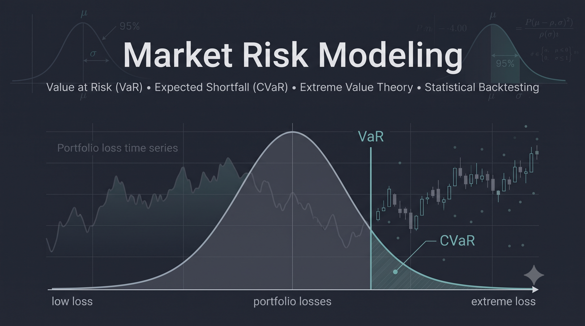
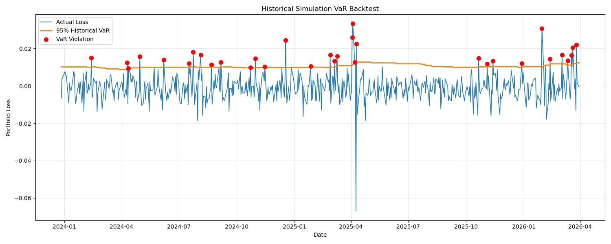

# Market Risk Modeling: Value at Risk (VaR), Expected Shortfall (CVaR) & Statistical Backtesting

[](https://python.org)
[]()



## Project Overview

Understanding potential losses is one of the core responsibilities of market risk management. In this project, I built a Python-based framework to estimate and compare portfolio risk using multiple Value at Risk (VaR) and Expected Shortfall (CVaR) methodologies.

Rather than relying on a single model, I implemented several widely used approaches and compared their behavior under the same market conditions. I also validated the Historical Simulation model using statistical backtesting techniques commonly used in industry.

This project helped me understand not only how different market risk models are implemented, but also why model validation is just as important as model construction.

---

## Objectives

The main objectives of this project were to:

- Construct an equal-weighted multi-asset portfolio.
- Estimate portfolio Value at Risk (VaR) using multiple methodologies.
- Compute Expected Shortfall (CVaR) for each model.
- Compare the behavior of different risk models.
- Validate the Historical Simulation model through rolling backtesting.
- Evaluate model performance using statistical hypothesis tests.

---

## Portfolio

The portfolio consists of four highly traded ETFs representing different asset classes.

| Asset | Description |
|--------|-------------|
| SPY | US Equities |
| QQQ | Technology Equities |
| TLT | Long-Term US Treasury Bonds |
| GLD | Gold |

All assets are assigned equal portfolio weights.

---

## Models Implemented

### Value at Risk (VaR)

- Historical Simulation
- Variance-Covariance (Parametric)
- Monte Carlo Simulation
- Cornish-Fisher Expansion
- Extreme Value Theory (Peak-over-Threshold)

### Expected Shortfall (CVaR)

- Historical Simulation
- Parametric
- Monte Carlo Simulation
- Extreme Value Theory (POT)

---

## Project Workflow

The project follows the workflow below.

```
Market Data
      │
      ▼
Portfolio Construction
      │
      ▼
Return & Loss Calculation
      │
      ▼
Distribution Analysis
      │
      ▼
VaR Estimation
      │
      ▼
CVaR Estimation
      │
      ▼
Model Comparison
      │
      ▼
Historical Simulation Backtesting
      │
      ▼
Kupiec Test
      │
      ▼
Christoffersen Independence Test
      │
      ▼
Conditional Coverage Test
```

---

## Backtesting

To evaluate model performance, I performed rolling walk-forward backtesting using Historical Simulation VaR.

The following statistical tests were implemented:

- Kupiec Proportion of Failures Test
- Christoffersen Independence Test
- Conditional Coverage Test

These tests evaluate:

- Whether the observed violation rate matches the expected confidence level.
- Whether VaR violations occur independently over time.
- Whether the model satisfies both conditions simultaneously.



---

## Technologies Used

- Python
- NumPy
- Pandas
- SciPy
- Matplotlib
- Statsmodels
- yfinance

---


## Key Takeaways

Through this project, I gained practical experience in:

- Portfolio loss modeling
- Tail risk measurement
- Comparing multiple VaR methodologies
- Expected Shortfall estimation
- Extreme Value Theory (Peak-over-Threshold)
- Statistical model validation
- Rolling window backtesting

---

## Limitations

This project has several simplifying assumptions.

- Equal-weight portfolio allocation.
- Daily returns only.
- Static portfolio weights.
- Historical data may not fully represent future market conditions.
- Cornish-Fisher approximation may become unstable for highly non-normal return distributions.
- Extreme Value Theory results depend on the selected threshold.
- Transaction costs and liquidity effects are ignored.

---

## Future Improvements

Some possible extensions include:

- Filtered Historical Simulation
- EWMA volatility estimation
- GARCH-based VaR
- Multi-day VaR forecasting
- Stress testing and scenario analysis
- Portfolio optimization under VaR constraints

---

## References

- Jorion, P. *Value at Risk: The New Benchmark for Managing Financial Risk.*
- McNeil, A., Frey, R., & Embrechts, P. *Quantitative Risk Management.*
- Hull, J. *Risk Management and Financial Institutions.*
- Dowd, K. *Measuring Market Risk.*

---


If you have any suggestions or feedback, feel free to connect with me on LinkedIn or explore the rest of my GitHub portfolio.
