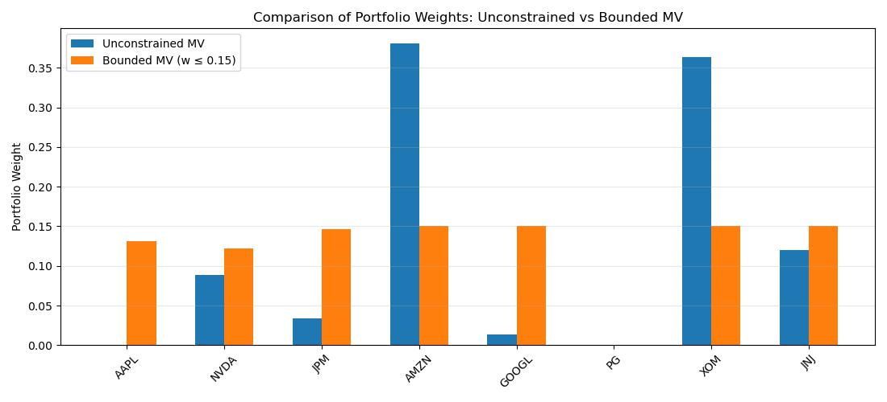
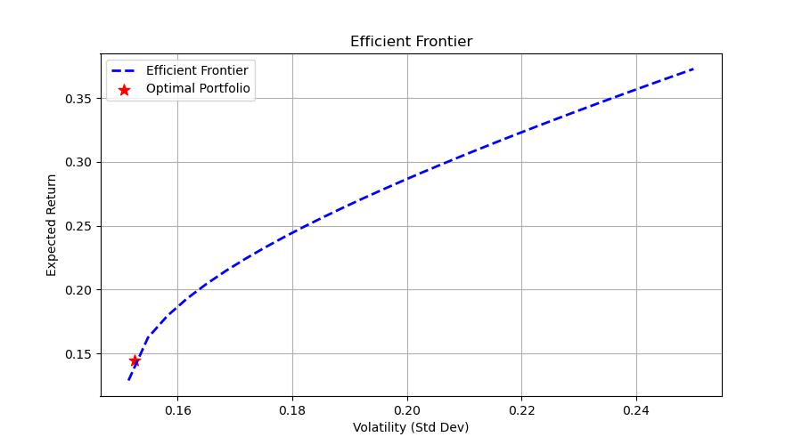

# Overview
This project focuses on **portfolio optimization** under **Markowitz** framework, using real historical price data of large-cap U.S. equities.
The following optimization tasks are performed:
1. Minimum-Variance Portfolio (MVP) using *CVXPY*
   - Unconstrained Upper Bound MVP
   - Constarint Upper Bound MVP (upper weight bound $\le$ 0.15)
   - Comparison of Portfolio Weights
2. Maximum-Return Portfolio at Target Volatility using *PyPortfolioOpt*
   - Construction of the efficient frontier
   - Selecting a portfolio that **maximizes return** for a chosen volatility
   - Plotting the frontier with the optimal point

# Mathematical Formulation
1. Minimum-Variance Portfolio 

The objective function for this problem is: 

  
$$\min_{w}\ \ w^T \Sigma w$$ 

subject to: 

$$
\Sigma_{i} w_{i} = 1,\ \ w_{i} \ge 0
$$

For the bounded constraint version of MVP, the second constraint will become:  

$$
0 \le w \le 0.15
$$

2. Maximum-Return Portfolio at Target Risk 

The objective function for this problem is: 

$$
\max_{w} \ \ \mu^T  w
$$

subject to: 

$$
w^T \Sigma w \le \sigma^2_{target},\ \ \Sigma_{i} w_{i} = 1,\ \ w_{i} \ge 0
$$

# Results

In the first task, using *CVXPY*, a Minimum-variance portfolio was generated.

The unconstrained solution produces the following results:
- **Expected Annual Return = 10.4%**
- **Expected Annual volatility = 15.1%**

For weights, please check the complete [solution file](./Mean-Variance%20Optimization.ipynb). This portfolio achieves the lowest possible volatility given the assets and constraints. However, it sacrifices diversification.

The constraint solution (upper bound of 15%) produces the following results:
- **Expected Annual Return = 15.3%**
- **Expected Annual volatility = 17.7%**

The cap constraint forces the portfolio to diversify, which increases expected return but also increases volatility. For weights, please check the complete [solution file](./Mean-Variance%20Optimization.ipynb).

The following bar plot compares both allocations.

The plot highlights how weight caps *improve* **diversification** and *prevent* **concentration**.

In the second task, using *PyPortfolioOpt*, the efficient frontier was generated and analyzed. 
The frontier reveals that the absolute **minimum portfolio volatility achievable** with the *assets* and *dataset* is **~15%**. 
This value matches the volatility observed in the unconstrained *CVXPY* solution.
For weights, please check the complete [solution file](./Mean-Variance%20Optimization.ipynb).

The following is the **efficient frontier** with the **optimal portfolio**.

The chosen point lies on the convex boundary of feasible portfolios, confirming that the optimizer achieved a mathematically efficient allocation.

# Tools and Libraries
- **Python** 3
- **CVXPY** - Convex optimization for MVP
- **PyPortfolioOpt** - Optimized Efficient Frontier method  
- **Numpy/Pandas** - Data handling
- **Matplotlib** - Visualization
- **yfinance** - Data fetching
