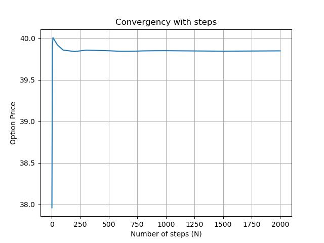

# Option Pricing and Sensitivity Analysis uder Discrete and Continuous-Time Models

## Overview

This project develops a comprehensive computational framework for pricing derivative securities using both **discrete-time** and **continuous-time** models.

The implemented models include:

- **Binomial Tree Model**
- **Trinomial Tree Model**
- **Black–Scholes Model**
- **Monte Carlo Simulation (Asian Options)**
- **Greeks (Sensitivity Analysis)**

The objective is to compare pricing approaches, analyze convergence behavior, and evaluate risk sensitivities across models.

---

# Mathematical Framework

## Risk-Neutral Stock Dynamics

Under the risk-neutral measure, stock prices follow:

$$
dS_t = r S_t dt + \sigma S_t dW_t
$$

Where:

- $S_t$ = Stock price  
- $r$ = Risk-free rate  
- $\sigma$ = Volatility  
- $W_t$ = Brownian motion  

---

# Discrete-Time Models

## Binomial Tree Model

At each time step $\Delta t$:

$$
S \rightarrow Su \quad \text{or} \quad Sd
$$

Where:

$$
u = e^{\sigma \sqrt{\Delta t}}, \quad d = e^{-\sigma \sqrt{\Delta t}}
$$

Risk-neutral probability:

$$
p = \frac{e^{r \Delta t} - d}{u - d}
$$

Option pricing is performed using backward induction.

For American options:

$$
V = \max(\text{Intrinsic Value}, \text{Continuation Value})
$$

---

## Trinomial Tree Model

The trinomial model allows three movements:

- Up  
- Middle  
- Down  

It improves numerical stability and often converges faster toward the Black–Scholes solution.

---

# Continuous-Time Model

## Black–Scholes Model

Let:

$$
\tau = T - t
$$

Define:

$$
d_1 = \frac{\ln(S/K) + (r + \sigma^2/2)\tau}{\sigma \sqrt{\tau}}
$$

$$
d_2 = d_1 - \sigma \sqrt{\tau}
$$

European Call:

$$
C = S N(d_1) - K e^{-r\tau} N(d_2)
$$

European Put:

$$
P = K e^{-r\tau} N(-d_2) - S N(-d_1)
$$

Black–Scholes serves as the benchmark for convergence comparison.

---

# Convergence Analysis

The following plot shows convergence of the Trinomial model toward the Black–Scholes price as the number of steps increases.

As $N$ increases, the discrete-time model stabilizes and approaches the continuous-time solution.

---

# European Option Pricing Results

| Model               | Call Price | Put Price |
|---------------------|------------|-----------|
| Binomial (N=100)    | 39.92      | 29.92     |
| Trinomial (N=100)   | 39.86      | 29.86     |
| Black–Scholes       | 39.85      | 29.85     |

The results demonstrate convergence of tree-based models toward the Black–Scholes benchmark.

---

# American vs European Comparison

| Option Type | European Price | American Price |
|-------------|---------------|----------------|
| Call        | 39.85         | 39.90          |
| Put         | 29.85         | 29.90          |

---

# Asian Option – Monte Carlo Results

| Simulations (M) | Call Price | Put Price | Standard Error |
|-----------------|------------|-----------|----------------|
| 100             | 27.07      | 17.45     | 0.1            |
| 1000            | 22.11      | 14.54     | 0.03           |
| 10,000          | 24.91      | 15.18     | 0.01           |

As the number of simulations increases, the estimator stabilizes and the standard error decreases at rate:

$$
\text{Error} \propto \frac{1}{\sqrt{M}}
$$

---

# Greeks (Black–Scholes)

| Greek  | Call Value | Put Value | Interpretation |
|--------|------------|-----------|----------------|
| Delta  | 0.72       | -0.27     | Sensitivity to stock price |
| Gamma  | 0.003      | 0.003     | Curvature |
| Vega   | 106.29     | 106.29    | Sensitivity to volatility |
| Theta  | -1.59      | -1.59     | Time decay |
| Rho    | 322.37     | -577.62   | Sensitivity to interest rate |

Greeks quantify exposure to key risk factors and are essential for hedging strategies.

---

# Key Insights

1. **Discrete models converge to continuous-time solutions.**
2. **American puts have early exercise premium.**
3. **Monte Carlo efficiently handles path-dependent payoffs.**
4. **Greeks provide essential risk management metrics.**

---

# Limitations

- Assumes constant volatility and interest rates.
- No transaction costs or market frictions.
- Monte Carlo implemented without variance reduction.
- No stochastic volatility modeling.
- No calibration to real implied volatility surface.

---

# Future Enhancements

- Implied volatility and volatility smile analysis  
- Variance reduction techniques (antithetic variates, control variates)  
- Stochastic volatility models (e.g., Heston)  
- Delta-hedging simulation  
- Market calibration  
- Interactive Greeks dashboard  

---

# Tools and Libraries

- Python 3.x  
- numpy  
- pandas  
- scipy  
- matplotlib  
- Jupyter Notebook  

---

## Author

**Asad Ali Akhtar**

---

*Last Updated: February 2026*
