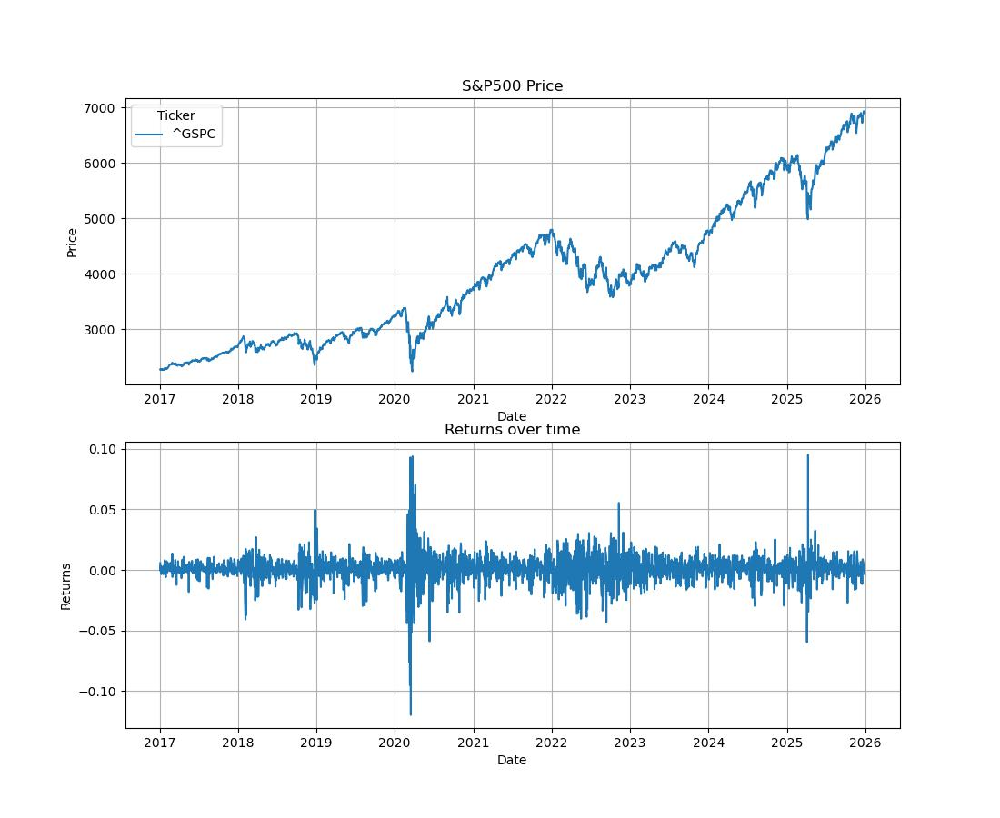
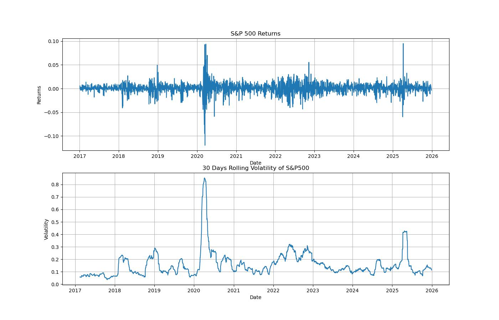

# Single-Asset Risk and Return Analysis

## Overview

This project conducts a comprehensive risk and return analysis on the **S&P 500 Index (^GSPC)** to understand its historical performance and risk characteristics over 9 years. While the S&P 500 is technically an index rather than an individual stock, it serves as an ideal candidate for this analysis because it represents a diversified basket of 500 large-cap U.S. companies, providing more stable and representative results than a single security might offer.

The analysis covers three distinct market phases:
- **Pre-COVID** (2017-2019): Relatively stable growth period
- **During-COVID** (2020): Market turmoil and recovery
- **Post-COVID** (2021-2025): Recovery and new highs

This project demonstrates key quantitative finance concepts, including return calculations, volatility analysis, rolling statistics, and risk metrics such as Value at Risk (VaR).

## Mathematical Formulations

### 1. Daily Returns

Daily percentage returns are calculated as:

$$R_t = \frac{P_t - P_{t-1}}{P_{t-1}}$$

where:
- $R_t$ = Return at time $t$
- $P_t$ = Price at time $t$
- $P_{t-1}$ = Price at time $t-1$

### 2. Annualized Return

The annualized return is computed by compounding daily returns:

$$R_{annual} = (1 + \mu_{daily})^{252} - 1$$

where:
- $\mu_{daily}$ = Mean daily return
- 252 = Number of trading days in a year

### 3. Annualized Risk (Volatility)

Volatility is annualized by scaling the standard deviation:

$$\sigma_{annual} = \sigma_{daily} \times \sqrt{252}$$

where:
- $\sigma_{daily}$ = Standard deviation of daily returns
- $\sqrt{252}$ = Square root of trading days (volatility scales with the square root of time)

### 4. Rolling Volatility

A 30-day rolling volatility captures the dynamic nature of risk:

$$\sigma_{rolling}(t) = \sigma_{30day}(t) \times \sqrt{252}$$

where the standard deviation is calculated over a 30-day rolling window.

### 5. Value at Risk (VaR)

VaR measures the maximum expected loss over a given time period at a specified confidence level using the historical simulation method:

$$\text{VaR}_{\alpha} = -\text{Quantile}(\alpha, R)$$

where:
- $\alpha$ = Confidence level (e.g., 0.05 for 95% confidence, 0.01 for 99% confidence)
- $R$ = Distribution of historical returns

## Dataset and Parameters

### Asset
- **S&P 500 Index (^GSPC)** - Market-capitalization-weighted index of 500 large-cap U.S. companies

### Time Period
- **Start Date**: January 1, 2017
- **End Date**: December 30, 2025
- **Duration**: ~9 years of daily price data
- **Total Trading Days**: 2,264 days

### Key Parameters
- **Trading Days per Year**: 252
- **Rolling Window**: 30 days (~1.5 months of trading)
- **VaR Confidence Levels**: 95% and 99%

## Analysis Results

### Price Performance

The S&P 500 demonstrates significant growth over the analysis period:

- **Starting Price** (Jan 2017): ~2,300 points
- **Ending Price** (Oct 2025): ~7,000 points
- **Total Growth**: +204% (~$204 gain per $100 invested)

**Key Events Visible in Price Chart:**

1. **Early 2020**: Sharp COVID-19 crash from ~3,400 to ~2,200 (-35% decline)
2. **2020-2021**: Strong V-shaped recovery to new highs
3. **2022**: Pullback due to inflation concerns and rising interest rates
4. **2024-2025**: Rally to new highs near 7,000 points

### Risk and Return Metrics

| Metric | Value |
|--------|-------|
| **Annualized Return** | 14.21% |
| **Daily Risk (Volatility)** | 1.17% |
| **Annualized Risk (Volatility)** | 18.62% |
| **Sharpe Ratio (approx.)** | ~0.61 |

**Interpretation:**

- The S&P 500 delivered a strong annualized return of **14.21%** over the 9-year period
- This return came with an annualized volatility of **18.62%**, indicating moderate risk
- Daily volatility of 1.17% means typical daily price swings of about ±1-2%

### Rolling Volatility Analysis

Rolling volatility reveals that market risk is far from constant:

**Volatility Observations:**

- **Normal Market Conditions**: Volatility typically ranges between 10-15% annually
- **Crisis Periods**: During the COVID-19 crash (March 2020), volatility exploded to **80-90%** annually
- **Crisis Risk Multiplier**: Markets became nearly **6x riskier** than usual during peak crisis
- **Volatility Clustering**: High volatility periods tend to cluster together, demonstrating market regime changes

### Value at Risk (VaR)

VaR quantifies downside risk at different confidence levels:

| Confidence Level | Daily VaR | Annual Equivalent | Interpretation |
|------------------|-----------|-------------------|----------------|
| **95% VaR** | -1.73% | ~-24% | Loss exceeded ~1 day per month (5% of days) |
| **99% VaR** | -3.37% | ~-42% | Loss exceeded ~2-3 days per year (1% of days) |

**Practical Interpretation:**

- **95% VaR (-1.73%)**: On 95 out of 100 trading days, daily losses stay below 1.73%. Approximately once per month, losses exceed this threshold.
- **99% VaR (-3.37%)**: On 99 out of 100 trading days, daily losses stay below 3.37%. Only 2-3 days per year see losses beyond this level.
- **Tail Risk**: The gap between 95% and 99% VaR shows the severity of worst-case scenarios

### Key Insights

1. **Strong Long-Term Performance**: Despite periods of extreme volatility, the S&P 500 delivered solid returns (14.21% annualized) over the 9-year period.

2. **Dynamic Risk Environment**: Volatility is not constant - it can surge by 6x during crisis periods, emphasizing the importance of dynamic risk management.

3. **Recovery Resilience**: The market demonstrated remarkable resilience, recovering from the COVID-19 crash and reaching new highs within 18 months.

4. **Downside Risk**: While average volatility was 18.62%, tail events (captured by VaR) show that extreme losses are possible, with 1% of days experiencing losses exceeding 3.37%.

5. **Risk-Return Trade-off**: The Sharpe ratio of approximately 0.61 indicates that investors were compensated for taking on equity market risk, though returns were somewhat lumpy due to crisis periods.

## Tools and Libraries

- **Python 3.x** - Core programming language
- **pandas** - Data manipulation and time series analysis
- **numpy** - Numerical computations and statistical functions
- **yfinance** - Historical price data retrieval from Yahoo Finance
- **matplotlib** - Data visualization and charting
- **seaborn** - Statistical data visualization

## Statistical Assumptions
- VaR uses historical simulation (non-parametric), making no distribution assumptions
- Rolling volatility uses a 30-day window as a balance between responsiveness and stability

### Limitations
- Historical analysis does not guarantee future performance
- VaR is a probabilistic measure and does not cap maximum losses
- Analysis based on daily data; intraday risk not captured
- Survivorship bias not applicable (S&P 500 is an index with constituent changes)

## Future Enhancements

Potential extensions to this analysis:

1. **Multi-Asset Comparison**: Compare risk-return profiles across multiple assets
2. **Conditional VaR (CVaR)**: Calculate expected shortfall beyond VaR threshold
3. **GARCH Modeling**: Model volatility clustering and forecast future volatility
4. **Monte Carlo Simulation**: Simulate potential future price paths
5. **Drawdown Analysis**: Analyze peak-to-trough declines and recovery periods
6. **Regime Detection**: Identify and classify different market regimes (bull/bear/crisis)
7. **Correlation Analysis**: Examine rolling correlations with other asset classes

## Author

**Asad Ali Akhtar**

